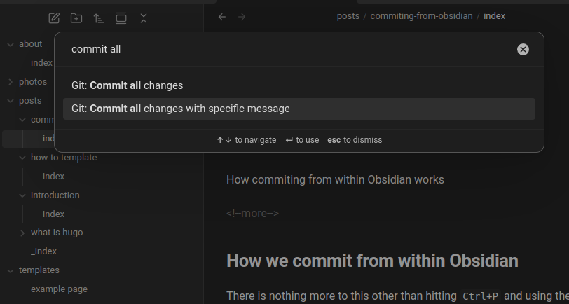

+++
title = "How commiting from Obsidian works"
date = "2025-04-04"
+++

How commiting from within Obsidian works

<!--more-->

## How we commit from within Obsidian

There is nothing more to this other than hitting `Ctrl+P` and using the `Git: Commit all changes with specific message` command.

## A note on `hugo serve`

If you use `hugo serve` while using Obsidian, Obsidian saves on almost every keystroke, which mean the site literally rerenders on each stroke.
